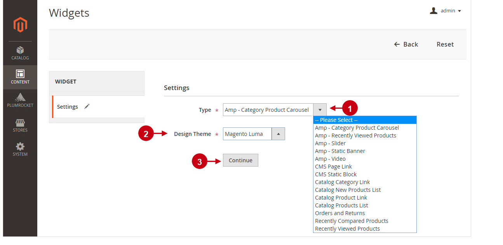

# AMP (Accelerated Mobile Pages)

1. AMP 和 PWA（Progressive Web Apps） 是 google 支持并推广的两个独立技术，可以单独或一起使用以提供高性能的客户体验。 [目前 Magento 只支持了 PWA，并未对 AMP 进行支持](https://community.magento.com/t5/Magento-DevBlog/Accelerated-Mobile-Pages-AMP-for-Magento-2/ba-p/75729)。 有一些数据显示， 与非AMP页相比，AMP页的加载速度快四倍，而数据使用量则减少10倍。

2. AMP 并不是一个扩展插件，而是一整套开发 WEB 的[框架和规范](https://amp.dev/documentation/guides-and-tutorials/start/create/basic_markup/?format=websites)。要想网站符合 AMP，网页要按照 AMP 的技术标准编写。例如 AMP 的 HTML 是标准 HTML 的一个子集，并对其进行了扩展。 例如：

    - `<html lang="en">`  改为  `<html amp lang="en">`
    - 引入 `` 的 AMP js 库。 
    - 包含 `<meta charset =“ utf-8”>` 标记作为其 `<head>` 标记的第一个子标签。
    - 在 `<head>` 内包含`<link rel =“ canonical” href =“ $ SOME_URL”>` 标签。
    - `<amp-img>` 替换 ``，`<amp-video>` 替换 `<video>`。 所有被替换和禁用的标签[地址](https://amp.dev/documentation/guides-and-tutorials/learn/spec/amphtml/?format=websites#html-tags)

除此之外，APM 还有一整套 AMP JS和AMP Cache。

3. 因为 Magento 并不是原生支持 APM，所以要优化页面达到 AMP 的要求，并不是一时半刻就能完全达到的，需要逐步的改进。 即便是使用第三方插件，也需要[对现有的元素进行改造](http://wiki.plumrocket.com/Magento_2_Accelerated_Mobile_Pages_v2.x_Configuration)。将现在自己写的代码标签进行改造，由于 css 可能和 HTML 标签关联，改完后需要验证效果在上线。 例如：

    1. 现有的 page, block 内的代码需要修改一遍。
    2. 将后台能显示 UI 的，改为三方库提供的 AMP 组件
    
    这里有其中一个扩展的详细[修改指导](http://wiki.plumrocket.com/Magento_2_Accelerated_Mobile_Pages_v2.x_Configuration)

由于扩展插件都是收会费的，没有找到免费的版本可用，所以我还内能测试将 AMP 插件基本的配置加上后优化的数据能达到多少的优化。

