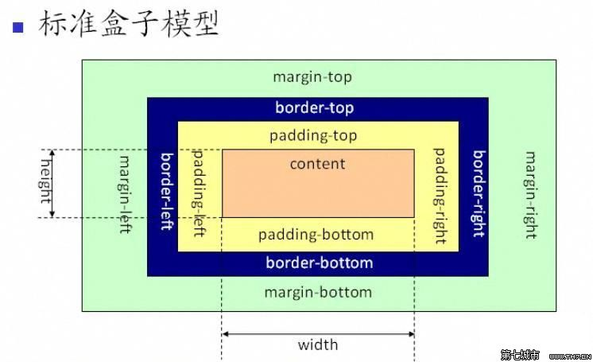

# Box model

css 将每一个元素看做是一个盒子，以此来解释各种属性，这种方式被称为盒模型。css 主要有以下几种盒模型：inline、inline-bolck、block、table、absolute position、float。每个盒模型是有以下几个属性组合所决定的：display、position、float、width、height、margin、padding和border等。不同的盒模型会产生不同的布局。

- Z-轴层叠：padding, content, background-img, background-color;
- 平面：border, margin, padding平面上的关系，并不能过程Z-轴的层叠。




> 外盒尺寸计算（元素空间尺寸）

element 空间高度 = 内容高度 + 内距 + 边框 + 外距
element 空间宽度 = 内容宽度 + 内距 + 边框 + 外距

> 内核储存计算（元素大小）

element 高度 = 内容高度 + 内距 + 边框
element 宽度 = 内容宽度 + 内距 + 边框

***【待测试】但是对于form中部分元素还基于ID的传统的盒模型，例如input中的submit、reset、button、select等元素***

#### 块级元素都具备盒子模型的特征

##### 边框（一）
盒子模型的边框就是围绕着内容及补白的线，这条线你可以设置它的粗细、样式和颜色(边框三个属性)。
```
div{
    border:2px  solid  red;
}
div{
    border-width:2px;
    border-style:solid;
    border-color:red;
}
```

注意：

1、border-style（边框样式）常见样式有：

dashed（虚线）| dotted（点线）| solid（实线）。


2、border-color（边框颜色）中的颜色可设置为十六进制颜色，如:

border-color:#888;//前面的井号不要忘掉。

3、border-width（边框宽度）中的宽度也可以设置为：

thin | medium | thick（但不是很常用），最常还是用象素（px）。

div{border-bottom:1px solid red;}


##### 填充pandding 边界margin
元素内容与边框之间是可以设置距离的，称之为“填充”。填充也可分为上、右、下、左(顺时针)。如下代码：

div{padding:20px 10px 15px 30px;}

如果上、右、下、左的填充都为10px;可以这么写
div{padding:10px;}

如果上下填充一样为10px，左右一样为20px，可以这么写：
div{padding:10px 20px;}

## css3 盒模型属性

标准的浏览器中，盒模型的高度和宽度仅仅包含了内容的宽度，出去了边框和内边距两个区域，这位Web设计处理效果增加了很多麻烦。为了解决这个问题，CSS3增添了一个盒模型属性box-zizing，能够实现定义盒模型尺寸解析方式。语法如下：
```
box-sizing: content-box | border-box | inherit
```

- content-box: 默认值，让元素维持W3C的标准盒模型。
- border-box: 让元素模型的解析改用IE传统的盒模型，元素的宽度=内边距 + 内容宽度 + 边框；高度=内边距 + 内容高度 + 边框。
- inherit: 元素继承父元素的盒模型模式。

## overflow css3内容溢出属性
在css中每一个元素都视为一个盒子，这个盒子就是一个容器。容器如果指定了固定的大小，内容过多时就会容纳不下。此时可以使用overflow属性来指定该如何显示何种容纳不下的内容。CSS3增加overflow-x和overflow-y来单独指定某个方向。

支持的属性值：

- visible: 默认值，不剪切容器中的任何内容，不添加滚动，元素将被剪切成包含对象大小的窗口对象。
- hidden: 内容溢出时，所有内容都隐藏，并且不显示滚动条。
- scroll: 不管内容有没有溢出，overflow-x都会显示横向的滚动条，而overflow-y会显示纵向的滚动条。
- auto: 在超出设定的大小时剪切内容，超出部分被隐藏，并显示滚动条。
- （不支持了？）no-display: 当内容溢出时，不显示整个元素，此时类似于元素添加了display:none。
- （不支持了？）no-content: 内容溢出时，不显示内容，此时类似于添加了sivibility：hidden声明。
- inherit: 继承父元素
- initial:
- unset:
- overlay:

## resize 自由缩放属性

***必须和overflow 同时使用*** 允许用户通古拖动的方式修改元素的尺寸来改变元素大小

none: 不能拖动元素而修改元素大小。
both: 可以通过拖动修改元素的宽度和高度
horizontial: 仅能够修改元素的宽度
vertical: 仅能够修改元素的高度
inherit: 继承父元素的属性值。

textarea 的默认 resize 属性设置为 both，可以通过修改resize属性值修改textarea的行为。

## outline 外轮廓属性

主要用户设置元素外的显示效果。外轮廓线不占用网页布局空间，不一定是矩形，外轮廓是一种动态样式，只有元素获得焦点或者被激活时呈现。

outline: [outline-color]||[outline-style]||[outline-width]||[outline-offset]|| inherit

- outline-offset: 定义轮廓边框的偏移位置的数值，此值可以取负值。当值取整数时，表示轮廓向外偏离多少像素；当值取负数时，表示轮廓向内偏移多少像素。

其他值同border 属性一致。

> 与border 对比

- 不会影响元素的大小，因此不会影响文档流，也不会破坏网页布局。

- border 可以设置个边框不一样，也可以单边设置。但是outline各边只能统一设置，始终是闭合的。
- outline 设置的外轮廓线可能是非矩形的，如果元素是多行，外轮廓线就至少是能够包含该元素所有框的外轮廓。可border不一样，它将使用一个边框包括整个元素。
- border只能向外扩展。而outline既可以向内，也可以向外扩展。


# 伸缩布局盒模型

使布局多列更加轻松。CSS3引入了一种新的布局模式————Flexbox布局。用来提供一个更加有效的方式指定、调整和分布一个容器里的项目布局，即使它们的大小事位置或者动态的。

布局是有一个盒与其兄弟、祖先和的关系决定尺寸与位置的原发。之前的布局方式有
- 块布局
- 行内布局
- 表格布局
- 定位布局
CSS3引入的Flexbox布局，主要是让容器有能力让其子元素能够改变其宽度、高度（甚至顺序），以最佳的方式填充可用空间。
重要的是，Flexbox布局方向不可预知，不像常规的布局（块就是从上到下，内联就是从左到右），对于大型护着复杂的应用程序（特别是设计去向以及改变、缩放）就缺乏灵活性。

## flexbox 功能特点

- 屏幕和浏览器窗口大小发生改变能够灵活调整布局
- 指定伸缩元素按主轴或侧轴按比例分配额外空间（伸缩容器额外空间），从而调整伸缩容器大小。
- 指定额外空间如何分配到可伸缩元素的周围。
- 控制元素在页面上的布局方向
- 按照不同于DOM所指定的顺序对元素从新排序。也即是可以在浏览器渲染中不按照文档流先后顺序重排伸缩元素顺序。


## 在网上查找中资料时，如何判断版本

flex-box 由于出现的较晚，在浏览器中经历了一个快速发展过程。

最老版本 -> 混合版本 -> 标准版本

如果在网上搜索资料，合法性许多老版本的资料。如何辨别这些内容，使用W#C最新版本的标注很有用。

- 看到 `display: box` 或者 `box-{*}` 说明是2009年版本的 Flexbox。
- 看到 `display: flexbox` 或者 `flex()` 函数，说明是2011年版本，也称为混合版本。
- 看到 `display: flex` 或者使用 `flex-{*}` 属性，说经是当前规范，也就是W3C 标注规范版本。

规范已经确定下来了，只需要使用规范版本即可。

## 使用伸缩布局

### 伸缩容器的设置
#### display: flex|inline-flex 伸缩容器

想要市容伸缩布局，只需要设置外部用于包裹内容的标签的display属性即可。
- flex: 将容器设置为块伸缩容器
- inline-flex: 将容器设置为内联伸缩容器

注意: css的 columns 在伸缩容器上没有效果，floa、clear、vertical-align在伸缩项目上没有效果。

#### flex-direction 伸缩流方向
 用于创建伸缩主轴，从而控制了伸缩项目在容器中摆放的方向。

 - row: （默认值）在 ltr 排版方式下，从左向右排列；在 rtl 排版方式下，从右向左排列。
 - row-reverse: 与row 排列方式相反，在 ltr 排版方式下，从右想左排列；在 rtl 排版方式下，从左向右排列。
 - column: 从上到下排列
 - column-reverse: 从下到上排列

#### 伸缩换行 flex-wrap 伸缩换行
flex-wrap 属性用于定义伸缩容器是单行显示还是多行显示，侧轴方向决定了新行的堆叠方向。

- no-wrap: 单行显示
- wrap: 多行显示
- wrap-reverse: 多行显示，显示方向与排版方向相反。让伸缩项目在侧轴方向的start和end翻转。

#### flex-flow 伸缩流方向与换行的缩写

flex-flow: <flex-direction> || <flex-wrap>

#### justify-content 主轴对齐方式
 定义伸缩项目沿着主轴线的对齐方式。当一行的所有项目都不能伸缩，或伸缩项目达到最大数目时，这一属性才会对伸缩容器额外空间进行分配。
- flex-start: 向一行的起始位置靠齐
- flex-end: 向一行的结束位置靠齐
- center: 向一行的中间位置靠齐
- space-between: 伸缩项目会平均地分配在项目之间的位置。第一个项目在一行的开始位置，最后一个项目在一行的结束位置。
- space-around: 伸缩项目会平均地分配在每隔一个项目两侧的位置。两端会保留一半的空间。

#### align-items 侧轴对齐方式

 调整伸缩项目在侧轴的对齐方式
- flex-start: 伸缩项目在行内靠近侧轴的起始方向对齐
- flex-end: 伸缩项目在行内靠近侧轴的结束方向对齐
- center: 伸缩项目在行内靠近中间对齐
- base-line: 伸缩项目靠近伸缩项目设置的基准线对齐
- stetch: （默认值) 伸缩项目将拉伸填充整个侧轴的行。此值会使用项目的外边距。 盒的项目在遵照尺寸属性限制（min/max-width/height）的情况下尽可能接近所在行的尺寸，

#### align-content 行堆叠方式
当伸缩容器的侧轴方向上还有额外空间时，align-content 用于调整伸缩行的对齐方式。它会更改 flex-wrap 的行为。

- flex-start: 各行向伸缩容器的起始位置堆叠
- flex-end: 各行向伸缩容器的结束位置堆叠
- center: 各行向侧轴的中间位置堆叠
- space-between: 侧轴方向上的剩余空间均匀分配在行之间的位置
- space-around: 侧轴方向上的剩余空间均匀分配在行两则的位置。
- stretch: 默认值，各行会伸展以占用额外空间。

### 伸缩项目的设置

#### align-self
ailgn-self 属性和 align-items 属性的作用和值都一样，用于调整伸缩项目在侧轴的对齐方式。ailgn-self 应用于单个项目，以覆盖整体的对齐方式。如果没有声明，则其值继承自 align-items 属性。

如果伸缩项目的任一项侧轴方向上的外边距设置为 auto，则 align-self 没有效果。

#### flex 伸缩性

让伸缩项目的宽度或高度的伸缩比例、伸缩基准值，以自动填充伸缩容器额外的空间。伸缩容器会按照伸缩项目设置的扩展比率分配额外空间，也会按照伸缩比率缩小伸缩项目以避免伸缩项目溢出容器。
flex: none | [<flex-grow> <flex-shrink>? || <flex-bisis>]

当一个项目是伸缩项目时，flex将代替主轴长度属性决定项目的主轴长度。若元素不是伸缩项目，则 flex 没有效果。

- flex-grow: 数字，用于设置伸缩项目在行中所占的比例，如果每个项目都这只为1，每个伸缩项目将占有大小相等的额外空间。如果一个伸缩项目的 flex-grow 设置为2，那它占有的额外空间将是其它项目的2倍。
- flex-shrink: 数字，定义伸缩项目的收缩能力。
- flex-basis: 用于设置伸缩基准值（和width值格式一致），即参与计算的主轴长度。默认值为 auto。如果 flex 省略此部件，则 flex-basis 被设置为0，此时伸缩项目最小为0。如果设置为 auto，则此项目的主轴长度是with值。

flex 设置为none时，相当于 flex-grow:0; flex-shink:0; flex-basis: auto。

- flex: 0 auto和flex: initial 与 flex: 0, 1, auto 作用相同。这也是 flex 的初始值。根据 width/height 属性决定项目尺寸。
- flex: auto 与 flex: 1 1 auto 效果相同。

#### order 显示顺序
 默认状态下，元素按照文档流的顺序显示。在伸缩布局中，项目可以按照 order 属性分配到的值，排序显示。 伸缩项目会按照序号从小到大的顺序排列，相同工号的项目将按照文档流的排序排列。

 
