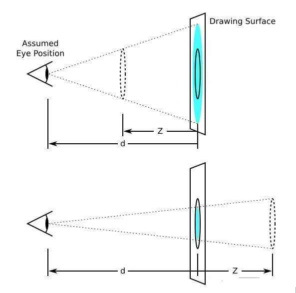
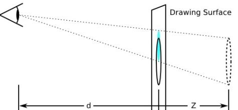
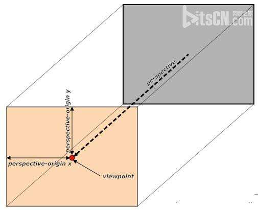

# tranform

变形是 CSS3 新加入的内容，它可以将元素转变成 2D 或 3D空间。动态的控制元素在屏幕周围移动它们，缩小或扩大，旋转、倾斜或结合所有这些效果产生复杂的动画效果。每个效果都称为变形函数（transform function）。通过 CSS3 变形，可以让元素产生静态视觉效果，也可以结合 CSS3 的transition 和动画的 keyframe 产生一些动画效果。

[TOC]

## tranform-style

如果使用 2D 平面的元素变形或动画，将不需要设置改属性。

transform-style: flat | preserve-3d;

- flat: 默认，所有子元素在 2D 平面呈现。沿着X轴或Y轴方向旋转该元素将导致位于正负轴位置的子元素显示在该元素而平面上，而不是它的前面或者后面。因为 2D 中没有 Z 轴，所以关于 Z 轴的设置都不会起作用，例如 retateZ，的值将会被忽略。
- preserve-3d: 所有子元素在 3D 空间中呈现。

设置容器 overflow: hideen 会导致 perserve-3d失效。
tranform-style 属性设置在父元素中，并且高于任何嵌套的变形元素。

## perspective 透视的视距

perspective 为透视的视距，我们人眼看到的物体是三维，但是显示器显示的结果却是一个二维的平面，为了让物体显示的更加真实，就跟照相机显示的效果一样，需要对三维物体像二维平面有一个投影。而观察点的远近和投影平面的远近不同，所投影出来的物体是不同的。

如图，d 就是要设置的视距（投影的投影距离），Drawing Surface 为投影的平面，可以假设为电脑屏幕。假设物体在屏幕前面时，即，物体在视点和屏幕之间，向屏幕投影时，投影后的平面效果将比原物体大；如果物体在屏幕的后面时，在屏幕的显示要比实际物体小。只有物体完全在屏幕上时，投影大小才和显示物体大小完全一样。

perspective: none | length;

当设置为 none 时，表示表示视点为无穷远，则可以认为物体几乎和屏幕重合的。所以显示效果和物体大小一样，所以看上去是平的。

length: 数值，不能为百分比。从投影原理可以知道，值越大，投影和原物体的差别越小。越接近于平面。

### perspective() 函数 于 perspective 属性

在 3D 变形中，除了 perspective 属性可以激活几个 3D 空间外，在 3D 变形的值中使用 perspective() 函数也可以激活 3D 空间，不同的是，perspective 用在变形元素的共同父元素上，perspective() 函数用在当前变形的元素上。

如 transform: perspective(600px);

**使用 perspective 属性设置时，将舞台整个作为整体投影，所有子元素将使用舞台元素（共同父元素）的视点进行投影的。而使用 perspective() 函数设置每个变形元素时，将对每个元素使用各自的视点进行投影，所以两者看起来是不一样的。[效果对比](http://www.zhangxinxu.com/study/201209/transform-perspective-same-rotate.html)**

## perspective-origin 视点

perspective-origin 是视点，当观察物体时，看到的物体形状不仅跟距离物体的远近有关，还跟看物体的角度有关。perspective-origin 则是观察点距离元素 Z 轴的偏移量。

当设置 perspective 之后，视距处可以和屏幕形成一个平行面。而 perspective-origin 则是视距在这个平面的偏移量。 舞台元素的原点为偏移的原点。而默认的偏移量是舞台元素的中间位置，即（50%，50%）。

perspective-origin: <offset> | <x-offset> <y-offset>

offset 可以使用百分数，像素值或关键词

关键词有： left、center、right、top、bottom。

## backface-visibility 透视可见性

决定元素旋转时，背面是否可见。默认背面在旋转超过 90° 之后是可见的。

backface-visibility: visible | hidden;

此外，该属性对 3D 物体也会有有影响，当设置为 visible 时，前面的物体并不能完全挡住后面的物体，前面的物体将是一种半透明名状态。可以看到后面的物体。

## transform-origin 指定变形中心点

默认情况下，变形的远点在元素的中心点，或者或元素X轴和Y轴50%处。transform-origin的使用相对参考系，元素左上角的位置为原点（0，0）

transform-origin: x-offset;
transform-origin: offset-keyword;

transform-origin: x-offset y-offset;
transform-origin: y-offset x-offset-keyword;
transform-origin: x-offset-keyword, y-offset;
transform-origin: y-offset-keyword x-offset-keyword;
transform-origin: x-offset-keyword y-offset-keyword;

transform-origin: x-offset y-offset z-offset;
transform-origin: y-offset x-offset-keyword z-offset;
transform-origin: x-offset-keyword y-offset z-offset;
transform-origin: x-offset-keyword y-offset-keyword z-offset;
transform-origin: y-offset-keyword x-offset-keyword z-offset;

offset: 2D可以使用百分比、em、px等单位，Z 轴使用百分比无效。
offset-keyword: top、right、bottom、left、center。

<!-- CSS3 的 rotate、scale、skew 都可以通过 transform-origin 属性重置元素的原点，但是位移的 translate 始终以元素中心进行位移。 -->
<!-- 这段话有疑问，因为位移是相对的，无论对于哪一点，相同位移值的都是一样的。 -->

## transform 变形

所有的变形都使用 transform 属性，该属性值为一组转换函数。tranform 属性让元素在一个坐标系统中变形，可以应用于内联元素和块元素。

transform: none | <tranform-function> [<tranform-function>]*

默认值为 none 表示不变形。

可以使用多个以空格分隔的变形函数，对变形进行叠加。

### translate 平移

translate()/translate3d() 可以根据 X 轴，Y 轴坐标重新定位元素位置。可以使用分级解的函数 translateX(), translateY(), translateZ().

translate(x, y);
translate3d(x, y, z);

参数为像素值。

### scale 拉伸

scale()/scale3d() 缩小放大元素，可以使元素尺寸发生变化。可以使用分解的 scaleX(), scaleY(), scaleZ().

scale(x, y): 放大倍数，大于1放大，小于1缩小。

### retate 旋转

rotate()/rotate3D() 旋转元素

rotate(<num>deg): 正数顺时针旋转，负数逆时针。

### skew 倾斜

让元素倾斜，可以使用 skewX(),skweY()。改属性没有Z轴的效果？

skew(<num>deg): 倾斜角度，正值为逆时针。

### matrix 定义矩阵变形

基于 （X, Y, Z）重新定义元素的位置。

基于 2D 的 matrix 需要有 6 个参数。

matrix(a, b, c, d, e, f)

对应的矩阵如下

$$ \left[ \begin{array}{ccc}
a & b & c \\
d & e & f \\
0 & 0 & 1 \end{array} \right] $$

通过 matrix 设置的变换是一种`前置矩阵`。

P498 
