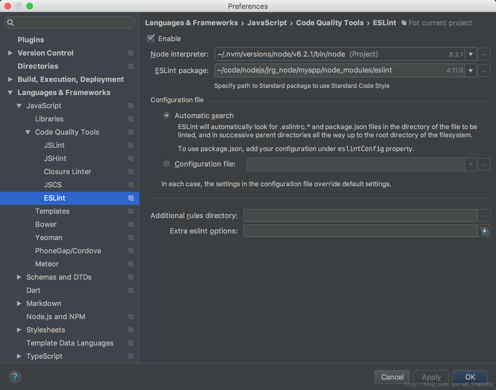

# Lint 语法检查器

在 C 语言还是一门新生语言的时候，一些常见的编程错误不能被原生的编译器捕获，于是一个名为 lint 的辅助城府被开发出来，他可以通过扫描文件来检查问题。

JS 是一门年轻的语言，这门语言松散的兼容性催生了一个针对 JavaScript 的lint，它可以用于检查常见的JavaScript代码错误，也可以进行代码风格检查。

ESLint是一个Javascript静态检查工具，它可以帮你养成良好的编程习惯，使你的javascript代码达到国际化的水准。ESLint是所有Javascrpt静态检查工具里最晚诞生的一个，之前还曾经有过JSLint以及JSHint等工具，但JSLint和JSHint都是用的一套标准，在目前这个前端技术飞速发展的时代已经显得有点落伍。ESLint的好处是既提供了国际大厂的标准，同时又给了你自定义标准的可能性。ESLint的推荐设置方式是按项目设置，但是如果我们有很多个不同的javascript项目的话，一个一个去设置未免太麻烦，所以在这里介绍的是全局设置方法，一次设置，所有项目全部采用同一标准。

## 安装
> 全局配置还是局部配置。
全局配置是在用户的主目录下安装和写入配置文件，整整个用户的所有配置都起作用。不用再在各个项目下配置。
局部配置是在各个项目下都配置一次。各个项目可以配置的不一样。

建议先配置全局配置，因为你不大可能在非常不同的编程风格中来回切换。大多数是一致的。然而全局配置对于一些没有使用语法检查的项目比较糟糕，会出现许多错误提示，但是由于积累深远，你可能没有那么多时间一一纠正错误。


下面，开始安装ESLint：
参考
https://blog.csdn.net/m0_37068028/article/details/78548148

使用 npm 的 -g 参数进行全局安装。

1. npm install eslint -g
或者，如果提示必须安装某个版本以上的话
npm install  -g eslint@4.9.0

ESLint是通过npm安装的，这里的-g选项代表全局，也就是说它不会把ESLint的可执行文件安装在你的项目文件夹或者说当前文件夹下。如果你没有设置这个-g选项的话，它会在你当前文件夹下安装ESLint可执行文件，那样就不是全局安装了。后面我们所有安装包都要用使用这个-g选项

1. eslint -v
安装完成之后，你可以先执行一下eslint -v这个命令来看一下eslint是否已经安装成功了，如果没有的话，你需要反复检查，直到确保eslint安装已经成功为止。

eslint 第一次配置，最好使用 eslint --init 来生成配置，因为从网上找到配置，都会有各种各样的问题。而且，根据配置过程，实际上会下载一些依赖包

然后把生成的 `.eslintrc` 配置拷贝到用户主目录下就可以做全局配置了。

关于eslint --init可以不必执行，它主要的作用是在你当前文件夹下生成.eslintrc文件，但同时也会把eslint在你当前文件夹下重新安装一遍，并且如果你使用包的话，它还会要求必须要有package.json文件，总之会很麻烦。但如果你是第一次使用的话，我建议你可以执行一下试试，它主要提供3种预安装包：Google标准、Airbnb标准和Standard标准。这3个标准里，Google就是Google公司的标准，Airbnb是Airbnb公司的标准，Standard就是一些前端工程师自定的标准。目前来看，公认的最好的标准是Airbnb标准（互联网发展日新月异，永远是年轻人颠覆老年人，连Google都老了）。它对于ES6要求最严格，比如禁止使用var定义变量，必须使用let或者const等等。既然采用最新标准，当然就让你的代码一次性向最高标准看齐，省得以后麻烦。


3. 安装 airhub 依赖, arihub 检测包
```
npm info "eslint-config-airbnb@latest" peerDependencies -g

npx install-peerdeps --dev eslint-config-airbnb
```


最后，编写我们自己的全局.eslintrc文件：

vi ~/.eslintrc.json


为项目服务的.eslintrc.json文件是放在项目文件夹下的，全局的.eslintrc.json文件则放在当前用户的根目录下，类Unix系统的当前用户目录是~，而Windows系统的话则是类似于C:\Windows\Users\Username这样的地方。
把以下代码放入.eslintrc.json，就做好了你的全局ESLint配置文件。

在atom中打开你的某一个js文件，随便改几个字符看看效果吧，不出所料的话，应该会出现一堆红色的错误。如果没有出现，不是你的代码没有问题，而是你没有安装对。

Airbnb的缺省标准是每行的缩进字符是2个空格键，而我一般喜欢使用4个空格键作缩进，所以这里需要一点小小的定制。另外，我缺省会大量使用jQuery，不想让它总是报告什么jQuery这个变量未定义等错误。所以增加了几行，最终的.eslintrc.json如下：
```
{
  "extends": [
    "airbnb",
    "prettier/react"
  ],
  "plugins": [
    "prettier"
  ],
  "env": {
    "browser": true,
    "jasmine": true
  },
  "rules": {
    "react/jsx-filename-extension": [1, {"extensions": [".js"]}],
    "prettier/prettier": "error"
  }
}
```

代改进
```
module.exports = {
    "extends": "airbnb",
    "rules": {
        // enable additional rules
        "indent": ["error", 4],
    }
};
```
这样你在任何项目中的js文件都会按照这同一套标准去检查。好了，现在可以开始改你的代码了，解决那一大堆红叉子吧，我相信一定不少。

## Atom 支持 ESLint

1. 首先，在atom中安装linter插件和linter-eslint插件。安装完成之后，linter-eslint的缺省设置有2个地方需要修改：

2. 把Disable when no ESLint config is found的对钩去掉。这个选项的意思是说：如果你的javascript项目文件夹中没有.eslintrc这样的配置文件的话，那么ESLint就不起作用。在这里，我们要设置为全局lint，不需要在每个javascript文件夹中包含.eslintrc文件，所以要把它去掉，否则由于我们的项目文件夹中没有.eslintrc文件，ESLint会不起作用。

把Use global ESLint installation的对钩勾上。因为我们使用的是全局的ESLint安装包。

## JetBrean 家族支持 ESLint




参考
https://segmentfault.com/a/1190000005984309
https://cnodejs.org/topic/57c68052b4a3bca66bbddbdd
https://blog.csdn.net/m0_37068028/article/details/78548148
https://georgespake.com/blog/eslint/
